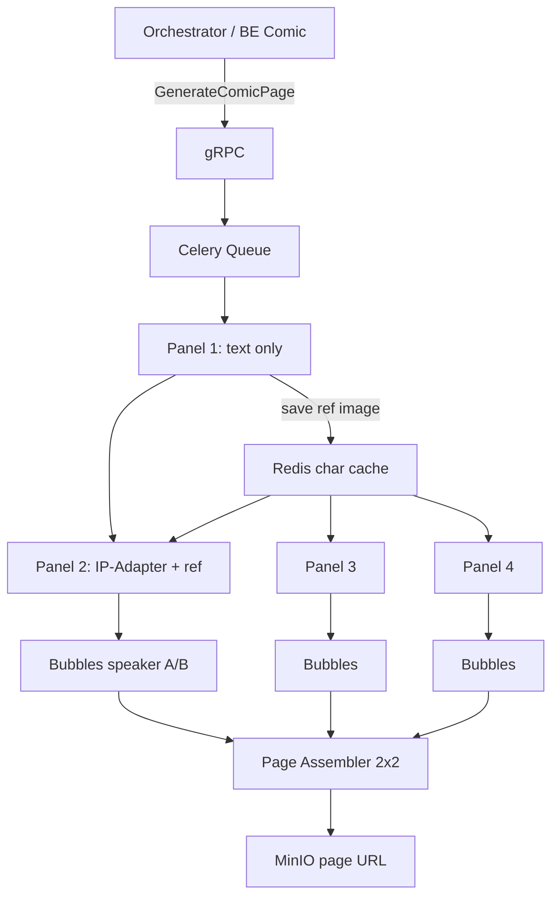

# Image Generation Service (image-ai) - Implementation TODO List

Đây là danh sách các tác vụ triển khai dịch vụ sinh ảnh và hậu kỳ tự động (`image-ai`) trong hệ thống ComicSystem.

Mục tiêu cuối: **trang truyện 2×2 (4 panel)**, mỗi panel có **bong bóng thoại theo nhân vật**, **nhất quán nhân vật** giữa các khung, ảnh **sắc nét không nhòe**, đủ số liệu **benchmark Mac vs GPU cloud** cho luận văn.

---

## Lộ trình triển khai (3 giai đoạn)

| Giai đoạn | Mục tiêu | Tiêu chí hoàn thành |
|-----------|----------|---------------------|
| **A — Mac ổn định** | Pipeline chạy đúng `.env`, đo được baseline, không OOM | 1 panel 512×512 ≤ 90s (sd-turbo, offload tắt); cache hit < 1s |
| **B — Tính năng truyện** | 4 panel + bubble đa nhân vật + ghép 2×2 + đồng bộ nhân vật | API `GenerateComicPage`; ảnh trang hoàn chỉnh trên MinIO |
| **C — GPU cloud (luận văn)** | Deploy worker CUDA, benchmark so sánh, demo bảo vệ | 4 panel ≤ 2 phút (1 GPU); bảng Mac vs Cloud trong thesis |

> **Lưu ý vận hành:** Sau mỗi lần sửa `.env` phải **restart Celery worker** — model/LoRA/offload được nạp **1 lần lúc worker start**, không đọc lại `.env` khi đang chạy.

---

## Benchmark đã đo (baseline — cần restart worker để cập nhật)

| Cấu hình (log 2026-06-06) | Diffusion 4 steps | Tổng task | Ghi chú |
|---------------------------|-------------------|-----------|---------|
| SDXL Turbo + LoRA + MPS sequential offload | ~192s (~48s/step) | **212s** | Worker start 09:54 — **chưa áp dụng `.env` mới** |
| Cache hit (cùng prompt/seed) | 0s GPU | **0.01s** | Redis cache hoạt động đúng |
| `.env` hiện tại (chưa restart worker) | sd-turbo, LoRA off, offload off | *chưa đo* | Cần restart worker rồi chạy lại `test_client.py` |

---

## Trạng thái MVP hiện tại (theo code + log)

*   **Đã chạy E2E** (`test_client.py`): gRPC, Celery, Redis, MinIO, diffusion, Pillow caption, cache hit/miss.
*   **Pipeline**: hỗ trợ SD 1.x Turbo + SDXL Turbo; CUDA / MPS / CPU; warmup singleton.
*   **LoRA**: loader cơ bản có (`lora_loader.py`); chưa LoRA per-request / MinIO artifact.
*   **Safety**: `Falconsai/nsfw_image_detection` đã tích hợp (TODO doc cũ chưa cập nhật).
*   **Caption**: 1 bubble cố định ở đáy ảnh (`caption_text`); proto có `speech_bubbles` nhưng **chưa implement**.
*   **Trang 2×2 / nhất quán nhân vật**: **chưa có** — cần Phase B.
*   **Cancel**: có; `test_cancel_task` gửi revoke sau khi task đã chạy xong → revoke muộn (cần hardening 4.2).

---

## Tiêu chí “DONE” production-ready

*   Cache key đúng mọi tham số ảnh hưởng output (đã có v5).
*   Thundering herd lock khi cache miss đồng thời (đã có).
*   Safety checker + policy FAILED rõ ràng.
*   Metrics + benchmark reproducible (Mac + Cloud).
*   Retry MinIO/Redis; không retry vô hạn khi OOM.
*   Cancel sạch VRAM; không revoke task đã SUCCESS.

---

## Phase 1: Setup & Infrastructure

- [x] **1.1 Cấu trúc & Môi trường**
- [x] **1.2 Định nghĩa gRPC** (`proto/image_generation.proto`)
- [x] **1.3 Cấu hình tập trung** (`settings.py`, `IMAGE_AI_*`)
- [x] **1.4 Production config discipline**
- [ ] **1.5 Model artifact quản lý**
    - [ ] Document profile model: `sd-turbo` (Mac dev), `dreamshaper-xl-v2-turbo` + LoRA (Cloud chất lượng)
    - [ ] Cache HuggingFace tại `MODEL_CACHE_DIR`; hành vi offline
    - [ ] Script kiểm tra worker đang chạy model nào (log / health endpoint)

---

## Phase 2: Core AI & Image Processing

### 2A — Tốc độ & chất lượng panel đơn (Giai đoạn A — Mac)

- [x] **2.1 Stable Diffusion Pipeline** (`pipeline_runner.py`)
- [x] **2.2 Warmup & singleton pipeline**
- [x] **2.3 VRAM & memory management**
- [x] **2.4 VRAM cleanup on cancel/timeout**
- [x] **2.9 Cache correctness** (hash v5: prompt, seed, caption, size, steps, model, guidance, lora, format)
- [ ] **2.10 Determinism & seed policy**
    - [x] `seed=-1` sinh ngẫu nhiên trong worker
    - [ ] Trả `seed` thực trong `GetTaskStatus` response (proto mở rộng nếu cần)
- [ ] **2.10b Mac performance profiles** *(mới)*
    - [ ] Profile `fast`: sd-turbo, 512×512, 4 steps, LoRA off, offload off
    - [ ] Profile `quality`: SDXL + LoRA — **chỉ dùng trên GPU cloud**, không kỳ vọng nhanh trên Mac
    - [ ] Document: `MPS_DECODE_ON_CPU` + `steps=4` — không tăng steps để “đẹp hơn” trên Mac (chậm tuyến tính)
    - [ ] **Restart worker sau đổi `.env`** — ghi vào Runbook

### 2B — Nhất quán nhân vật (Giai đoạn B — bắt buộc cho 4 khung)

- [ ] **2.11 Character Consistency** — **ƯU TIÊN CAO**
    - [ ] Thiết kế `CharacterReference` trong proto: `character_id`, `reference_image_url`, `description`
    - [ ] Panel 1: sinh từ text; lưu ảnh panel 1 làm reference cho panel 2–4
    - [ ] Tích hợp **IP-Adapter** (hoặc InstantID) vào pipeline — đọc `reference_image_url`
    - [ ] Cache embedding theo `character_id` trong Redis (TTL) để không tính lại mỗi panel
    - [ ] Prompt template: giữ `character_id` + mô tả cố định xuyên suốt 4 panel
    - [ ] *Mac:* chấp nhận chậm hơn; *Cloud:* bật IP-Adapter đầy đủ

### 2C — Thoại & layout truyện (Giai đoạn B)

- [x] **2.7 Pillow caption cơ bản** (1 bubble đáy, `caption_text`)
- [~] **2.8 Comic layout robustness** *(một phần)*
    - [x] Font cache (`@lru_cache` trong `image_processing.py`)
    - [ ] Font fallback chuẩn hóa cross-platform (Mac/Linux/Docker)
    - [ ] Giới hạn độ dài + ellipsis khi tràn bubble
- [ ] **2.12 Dynamic Speech Bubbles** — **ƯU TIÊN CAO**
    - [ ] Mở rộng proto `SpeechBubble`: thêm `speaker_id`, `speaker_name` (hiển thị optional)
    - [ ] Parse `repeated speech_bubbles` trong gRPC → worker (thay/thêm `caption_text`)
    - [ ] Vẽ bubble tại `(x_pos, y_pos)` — tọa độ normalized 0..1
    - [ ] Style: `SPEECH` (oval), `THOUGHT` (cloud), `SCREAM` (spiky)
    - [ ] Tránh chồng bubble: collision detection đơn giản
    - [ ] Hash cache key bao gồm `speech_bubbles` JSON (không chỉ `caption_text`)

- [ ] **2.15 Page Panel Layout Assembler (2×2)** — **ƯU TIÊN CAO**
    - [ ] API mới: `GenerateComicPageAsync` (hoặc orchestrator gọi 4 panel rồi ghép)
    - [ ] Module `page_assembler.py`: ghép 4 panel → lưới 2×2 + gutter + viền trang
    - [ ] Kích thước panel đề xuất: 512×512 → trang ~1080×1080 (+ gutter)
    - [ ] Upload trang hoàn chỉnh lên MinIO; cache key cấp **page** (4 panel + layout)

- [ ] **2.16 Comic Page Orchestration** *(mới)*
    - [ ] Celery task `generate_comic_page_task`: 4 panel tuần tự (Mac) / song song (Cloud multi-GPU sau)
    - [ ] Panel 1 → lưu reference URL → panel 2–4 dùng IP-Adapter
    - [ ] Mỗi panel nhận `speech_bubbles[]` riêng theo nhân vật
    - [ ] Trả progress: `panel 1/4`, `2/4`, … qua task meta hoặc gRPC stream (optional)

### 2D — Chất lượng hình (không nhòe)

- [ ] **2.13 Upscaling** — **CHỈ bật trên GPU cloud**, tắt mặc định Mac
    - [ ] Real-ESRGAN 2× sau inference (optional flag)
    - [ ] Hoặc: sinh 768×768 trên cloud thay vì upscale 512
- [~] **2.5 LoRA**
    - [x] Load/unload cơ bản, format validation
    - [ ] LoRA SD 1.x cho sd-turbo (khác EldritchComicsXL chỉ SDXL)
    - [ ] LoRA per-request + cache adapter
    - [ ] Tải LoRA từ MinIO
    - [ ] *Cloud only:* EldritchComicsXL + dreamshaper-xl cho style comic đẹp nhất

- [~] **2.6 Content Safety**
    - [x] Classifier thật (`Falconsai/nsfw_image_detection`)
    - [ ] Benchmark độ chính xác; map `BLOCKED` trong proto (optional)
    - [ ] Cho phép tắt qua env khi dev Mac (đã có implicit fallback)

- [ ] **2.14 Pre-GPU text moderation** (optional)

---

## Phase 3: Storage & Caching

- [x] **3.1 MinIO upload RAM + presigned URL**
- [x] **3.3 Redis cache MD5**
- [x] **3.4 Thundering herd lock**
- [x] **3.5 Cache versioning** (v5)
- [ ] **3.2 MinIO reliability** (retry, timeout)
- [ ] **3.6 Celery result vs cache thống nhất**
- [ ] **3.7 Page-level cache** *(mới)*: cache cả trang 2×2, không chỉ từng panel

---

## Phase 4: gRPC & Celery

- [x] **4.1–4.5** Async generate, status, cancel, validation, macOS solo pool
- [ ] **4.2b Cancel race fix** *(mới)*: revoke task đang PROCESSING; không revoke sau SUCCESS
- [ ] **4.6 Worker reliability** (retry network, OOM taxonomy)
- [ ] **4.7 Backpressure / rate limit**
- [ ] **4.8 Correlation id trong log**
- [ ] **4.9 GenerateComicPage gRPC** *(mới)* — endpoint batch 4 panel + page assembly

---

## Phase 5: Monitoring

- [x] **5.1 Prometheus** (requests, duration, cache hit/miss, safety, active_gpu_tasks)
- [x] **5.2 `/healthz`**
- [ ] **5.1b** `cache_hit_ratio` gauge; label `device=mps|cuda`
- [ ] **5.1c** GPU metrics CUDA (`pynvml`) — Giai đoạn C
- [ ] **5.3 Tracing** (optional OpenTelemetry)

---

## Phase 6: Testing & Documentation

- [x] **6.1 `test_client.py`**
- [ ] **6.2 Unit tests** (wrap_text, hash key, safety mock, minio mock)
- [ ] **6.3 Integration** (cache hit, cancel đúng timing)
- [~] **6.4 Benchmarks** — **đang làm**
    - [x] Baseline Mac SDXL+LoRA+offload: **212s/panel** (log 2026-06-06)
    - [x] Cache hit: **0.01s**
    - [ ] Sau restart: sd-turbo profile
    - [ ] 4 panel tuần tự Mac vs 1 page task
    - [ ] Cloud CUDA cùng prompt (Giai đoạn C)
- [ ] **6.5 Docs**: `API.md`, `Runbook.md` (nhấn mạnh restart worker)

---

## Phase 7: GPU Cloud (Giai đoạn C — sau khi Phase B ổn trên Mac)

- [ ] **7.1 Docker production** (multi-stage, non-root, HEALTHCHECK)
- [ ] **7.2 GPU runtime**
    - [ ] Bật `nvidia` trong `docker-compose.yml`
    - [ ] Worker CUDA: sd-turbo (nhanh) hoặc SDXL+LoRA (đẹp) — 2 profile
    - [ ] Network volume cache model
- [ ] **7.3 Auto-restart** (supervisor/systemd)
- [ ] **7.4 CI/CD** (pytest CPU-only, docker build)

---

## Phase 8: Deliverables luận văn

*   Sơ đồ: Orchestrator → gRPC → Celery → 4× Panel → Page Assembler → MinIO.
*   Bảng benchmark: Mac (A) vs Cloud (C); cache hit; cold vs warm.
*   Phần **Character Consistency**: IP-Adapter + reference chain panel 1→4.
*   Phần **UX truyện**: speech bubble đa nhân vật + layout 2×2.
*   Reliability: cancel, VRAM, timeout, thundering herd.
*   Safety + Observability.

---

## Thứ tự làm tiếp (đề xuất tuần này)

1. **Restart worker** → xác nhận log in `sd-turbo`, `LoRA disabled`, `offload=false` → đo lại thời gian.
2. **6.4** Ghi benchmark vào bảng trên.
3. **2.12** Speech bubbles đa nhân vật (proto đã có).
4. **2.11** IP-Adapter + reference từ panel 1.
5. **2.15 + 2.16** Ghép trang 2×2 + task `generate_comic_page`.
6. **7.2** GPU cloud + benchmark thesis.

---

## Kiến trúc mục tiêu — Trang 2×2

**Mục tiêu thời gian (realistic):**

| Môi trường | 4 panel + ghép trang |
|------------|----------------------|
| Mac + sd-turbo + IP-Adapter | ~4–8 phút (chấp nhận cho dev) |
| GPU cloud RTX 4090 | ~1–2.5 phút |
| Cache hit (cùng trang) | < 5 giây |
