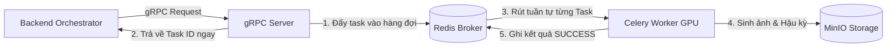

# Hướng dẫn Kiến trúc & Chuẩn hóa Production cho Dịch vụ Sinh ảnh (image-ai)

Chào bạn, đây là tài liệu hướng dẫn bài bản, chuyên nghiệp và dễ hiểu nhất để xây dựng và tối ưu dịch vụ **Image AI (Stable Diffusion)** đạt chuẩn **Production-ready** (sẵn sàng chạy thực tế với tải trọng cao).

Dịch vụ Sinh ảnh AI có đặc thù rất khác so với các dịch vụ Web/API truyền thống vì nó tiêu tốn **năng lượng tính toán cực kỳ lớn (GPU/VRAM)** và **thời gian xử lý lâu (vài giây tới hàng phút)**. Nếu không thiết kế đúng cách, hệ thống sẽ sập (`CUDA Out Of Memory`) ngay khi có từ 2-3 người dùng cùng lúc.

Dưới đây là 7 cột mốc kiến trúc bạn cần nắm lòng và triển khai.

---

## 1. Kiến trúc Bất đồng bộ & Hàng đợi (Asynchronous & Queue)
> [!IMPORTANT]
> **Tại sao cần thiết?**
> Nếu chạy sinh ảnh đồng bộ trực tiếp trên Web Server (FastAPI/gRPC), khi có nhiều request đồng thời, GPU sẽ cố gắng xử lý song song tất cả các request này. Kết quả là VRAM bị quá tải ngay lập tức và gây sập dịch vụ.

### Giải pháp Production:
*   **gRPC API Server (Dây chuyền tiếp nhận)**: Chỉ làm nhiệm vụ nhận yêu cầu từ Backend chính, ghi nhận tham số, sinh ra một `task_id` duy nhất và đẩy vào hàng đợi (Redis/Celery), sau đó trả về ngay lập tức cho client. Thời gian phản hồi chỉ dưới **50ms**.
*   **Celery Worker (Dây chuyền xử lý)**: Chạy độc lập, chỉ rút từng tác vụ một từ hàng đợi ra để xử lý (`concurrency=1` trên mỗi GPU). Việc này đảm bảo GPU luôn chạy ở hiệu suất tối đa nhưng không bao giờ bị quá tải bộ nhớ.



---

## 2. Quản lý và Giải phóng VRAM (VRAM Management)
> [!IMPORTANT]
> **Tại sao cần thiết?**
> PyTorch có cơ chế giữ lại bộ nhớ đã cấp phát (caching) để tái sử dụng cho các lần sau. Tuy nhiên trong môi trường dùng chung, việc này làm cạn kiệt tài nguyên GPU nhanh chóng.

### Giải pháp Production:
*   **Tối ưu hóa Pipeline**: Sử dụng `enable_vae_slicing()` và `enable_vae_tiling()` từ thư viện `diffusers`. Cơ chế này chia nhỏ bức ảnh thành từng mảnh để giải mã (decode) thay vì decode cả cụm, giúp giảm VRAM cần thiết từ **12GB xuống còn 6-8GB** đối với SDXL mà chất lượng không đổi.
*   **Thu dọn bộ nhớ chủ động**:
    Sau mỗi Task sinh ảnh hoàn tất (kể cả lỗi), Celery Worker bắt buộc phải gọi dọn dẹp:
    ```python
    import gc
    import torch

    gc.collect()
    if torch.cuda.is_available():
        torch.cuda.empty_cache()  # Giải phóng bộ nhớ CUDA
    elif torch.backends.mps.is_available():
        import torch.mps
        torch.mps.empty_cache()   # Giải phóng bộ nhớ trên Mac M1/M2/M3
    ```

---

## 3. Chiến lược Lưu trữ Trực tiếp trên RAM (In-Memory Storage)
> [!IMPORTANT]
> **Tại sao cần thiết?**
> Việc ghi ảnh ra đĩa cứng của server (`/tmp/image.jpg`) rồi đọc lại để upload lên Object Storage là một phản mẫu (Anti-pattern). Ghi đĩa gây nghẽn cổ chai I/O, làm giảm tuổi thọ ổ cứng SSD của server và gây khó khăn khi scale ứng dụng ra nhiều container (do đĩa cứng bị cô lập).

### Giải pháp Production:
*   Giữ bức ảnh trong RAM dưới dạng đối tượng PIL Image.
*   Chuyển đổi thành luồng byte nhị phân (`io.BytesIO`) và upload thẳng lên MinIO/S3 qua mạng.
*   Trả về **Presigned URL** (đường dẫn tạm thời có thời hạn, ví dụ: 7 ngày) để Frontend hiển thị thẳng cho người dùng mà không cần đi qua Backend trung gian.

```python
import io
from PIL import Image

# Lưu vào RAM dạng Bytes
img_byte_arr = io.BytesIO()
image.save(img_byte_arr, format='JPEG', quality=95)
img_byte_arr.seek(0)

# Upload trực tiếp
minio_client.put_object(
    bucket_name="comic-images",
    object_name="filename.jpg",
    data=img_byte_arr,
    length=len(img_byte_arr.getvalue()),
    content_type='image/jpeg'
)
```

---

## 4. Prompt Result Caching (Tránh lãng phí tài nguyên GPU)
> [!IMPORTANT]
> **Tại sao cần thiết?**
> Trong truyện tranh, nhiều nhân vật hoặc bối cảnh sẽ có prompt giống hệt nhau ở các khung hình khác nhau. Việc chạy mô hình AI để vẽ lại một bức ảnh giống hệt là cực kỳ lãng phí tiền bạc và thời gian.

### Giải pháp Production:
*   Băm (Hash MD5) toàn bộ tham số đầu vào: `md5(prompt + seed + size + caption)`.
*   Lưu kết quả link ảnh MinIO vào Redis Cache với khóa là mã hash trên (thời gian hết hạn TTL là 14 ngày).
*   Khi có request mới, kiểm tra Redis trước. Nếu trúng cache (Cache Hit), trả về link ảnh ngay lập tức (**0 giây xử lý GPU**).

---

## 5. Quản lý Cấu hình Tập trung (Pydantic Settings)
> [!IMPORTANT]
> **Tại sao cần thiết?**
> Việc gọi `os.getenv` trực tiếp ở khắp nơi khiến ứng dụng khó quản lý, dễ lỗi chính tả tên biến môi trường và không tự động ép kiểu (ví dụ: port đọc từ env sẽ là string `"50051"` thay vì int `50051`).

### Giải pháp Production:
*   Sử dụng thư viện `pydantic-settings` để định nghĩa một file cấu hình duy nhất `src/config/settings.py`.
*   Tự động ép kiểu dữ liệu (chuyển `"True"` thành `True`, `"50051"` thành `50051`).
*   Có giá trị mặc định rõ ràng cho môi trường local để dev chỉ cần chạy luôn mà không bắt buộc tạo file `.env`.

---

## 6. Hủy Tác vụ (Task Revocation / Cancelling)
> [!IMPORTANT]
> **Tại sao cần thiết?**
> Người dùng có thể nhấn nút "Hủy sinh ảnh" hoặc tắt trình duyệt khi đang đợi trong hàng đợi. Nếu không có cơ chế hủy, GPU vẫn tiếp tục sinh ra bức ảnh đó và làm nghẽn hàng đợi của những người dùng khác.

### Giải pháp Production:
*   Cung cấp API `CancelTask(task_id)` qua gRPC.
*   Gọi lệnh thu hồi nhiệm vụ của Celery: `celery_app.control.revoke(task_id, terminate=True, signal='SIGKILL')`.
*   Lập tức dừng tiến trình sinh ảnh đang chạy để nhường GPU cho tác vụ tiếp theo.

---

## 7. Giám sát Sức khỏe & Hiệu năng (Monitoring & Health Check)
> [!IMPORTANT]
> **Tại sao cần thiết?**
> Khi chạy thực tế, container có thể bị treo hoặc GPU bị quá nhiệt. Chúng ta cần các chỉ số thời gian thực để hệ thống tự động khởi động lại (K8s/Docker Auto-heal).

### Giải pháp Production:
*   **FastAPI Health Server**: Chạy song song trên một luồng phụ (daemon thread) cung cấp endpoint `/healthz` để kiểm tra kết nối giữa Service với Redis và MinIO.
*   **Prometheus Metrics**: Cung cấp endpoint `/metrics` đo lượng VRAM còn lại, nhiệt độ GPU, số lượng tác vụ đang chờ trong hàng đợi (Queue Length) và thời gian sinh ảnh trung bình.
