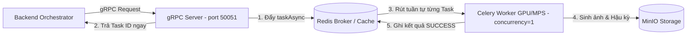

# Hướng dẫn Kiến trúc & Chuẩn hóa Production cho Dịch vụ Sinh ảnh (image-ai)

Tài liệu hướng dẫn chuyên sâu về kiến trúc, tối ưu hóa và chuẩn hóa **Production-ready** cho dịch vụ **Image AI (Stable Diffusion)** trong hệ thống **ComicSystem**.

Dịch vụ Sinh ảnh AI có đặc thù tiêu tốn **tài nguyên tính toán cực kỳ lớn (GPU/VRAM)** và **thời gian xử lý kéo dài (từ vài giây đến vài phút)**. Nếu không được thiết kế kiến trúc chuẩn hóa, dịch vụ sẽ lập tức quá tải hoặc sập do cạn kiệt bộ nhớ (`CUDA Out Of Memory` / `MPS OOM`) khi xuất hiện đồng thời từ 2-3 người dùng.

Dưới đây là **9 cột mốc kiến trúc trọng tâm** được áp dụng trong dịch vụ `image-ai`.

---

## 1. Kiến trúc Bất đồng bộ & Hàng đợi (Asynchronous & Queue)

> [!IMPORTANT]
> **Tại sao cần thiết?**
> Nếu thực hiện sinh ảnh đồng bộ trực tiếp trên Web/gRPC Server, khi có nhiều request đồng thời, GPU sẽ cố gắng xử lý song song tất cả các request này. Kết quả là VRAM bị quá tải ngay lập tức, gây sập process toàn bộ dịch vụ.

### Giải pháp Production:
*   **gRPC API Server (Process Tiếp nhận)**: Tiếp nhận yêu cầu từ Orchestrator/Backend, thực hiện kiểm tra tham số (validation), áp dụng các quy tắc tự động điều chỉnh (heuristics), tạo `task_id` duy nhất và đẩy vào hàng đợi Redis/Celery. Trả về ngay lập tức cho client trong thời gian **< 50ms**.
*   **Celery Worker (Process Xử lý GPU)**: Chạy độc lập với cấu hình tuần tự (`concurrency=1` trên từng GPU/Worker). Worker rút từng tác vụ một từ hàng đợi ra để xử lý, đảm bảo GPU luôn đạt hiệu suất cao nhất mà không bị quá tải bộ nhớ.



---

## 2. Phân tách Process & Cờ Báo Sức Khỏe Worker (Worker Health Flag)

> [!IMPORTANT]
> **Tại sao cần thiết?**
> gRPC/FastAPI Server (`src/server.py`) và Celery Worker (`src/worker/tasks.py`) là **2 process Python độc lập**. Chúng không chia sẻ bộ nhớ (state) trực tiếp với nhau. Kiểm tra trực tiếp biến cục bộ của server process sẽ luôn báo sai trạng thái của worker.

### Giải pháp Production:
*   Khi Celery Worker khởi tạo và warmup xong model Stable Diffusion (`@worker_process_init.connect`), worker tự động ghi cờ trạng thái vào Redis:
    ```python
    WORKER_READY_KEY = "image_ai:worker_ready"
    redis_cache_manager.client.set(WORKER_READY_KEY, "1")
    ```
*   Endpoint kiểm tra sức khỏe HTTP `/healthz` trên FastAPI (port 8000) truy vấn trực tiếp cờ Redis này để phản ánh chính xác trạng thái sẵn sàng thực tế của GPU Worker.

---

## 3. Quản lý và Giải phóng VRAM/RAM (VRAM Management & Memory Tuning)

> [!IMPORTANT]
> **Tại sao cần thiết?**
> PyTorch giữ lại bộ nhớ đã cấp phát (caching) để tái sử dụng. Trên GPU CUDA hoặc Apple Silicon MPS (Mac 8GB), nếu không giải phóng đúng cách hoặc dùng sai kiểu dữ liệu (fp32/fp16), hệ thống sẽ lập tức rơi vào swap-thrashing hoặc lỗi tràn số NaN (ảnh ra đen/rác).

### Giải pháp Production:
*   **Tối ưu hóa Pipeline**: Sử dụng `enable_vae_slicing()` và `enable_vae_tiling()` từ `diffusers` để chia nhỏ bức ảnh thành từng mảnh khi decode, giúp giảm bộ nhớ VRAM cần thiết từ **12GB xuống còn 6-8GB** đối với SDXL.
*   **Tối ưu hóa Apple Silicon (Mac MPS)**:
    *   Sử dụng VAE decode trên CPU (float32) qua cấu hình `MPS_DECODE_ON_CPU=True` và `MPS_VAE_FP32=True` để tránh hiện tượng NaN decode khi UNet chạy fp16.
    *   Dùng `torch.Generator` trên CPU (`MPS_USE_CPU_GENERATOR=True`) đảm bảo tính ổn định của hạt giống random (seed).
*   **Thu dọn bộ nhớ chủ động**:
    Sau mỗi task hoàn tất (hoặc bị hủy), hệ thống thực hiện dọn dẹp bộ nhớ:
    ```python
    import gc
    import torch

    gc.collect()
    if torch.cuda.is_available():
        torch.cuda.empty_cache()
    elif torch.backends.mps.is_available() and settings.MPS_CLEAR_CACHE_AFTER_GENERATE:
        import torch.mps
        torch.mps.empty_cache()
    ```

---

## 4. Chiến lược Lưu trữ Trực tiếp từ RAM (In-Memory Storage & Presigned URLs)

> [!IMPORTANT]
> **Tại sao cần thiết?**
> Ghi ảnh tạm ra đĩa cứng của server (`/tmp/image.jpg`) rồi đọc lại để upload là phản mẫu (Anti-pattern) gây nghẽn cổ chai I/O, giảm tuổi thọ SSD và không thể mở rộng (scale) đa container.

### Giải pháp Production:
*   Giữ bức ảnh hoàn chỉnh trong RAM dưới dạng đối tượng `PIL.Image`.
*   Encode thành luồng byte nhị phân (`io.BytesIO`) và upload trực tiếp lên MinIO Bucket qua mạng.
*   Tạo và trả về **Presigned URL** có thời hạn cấu hình (`IMAGE_AI_PRESIGNED_TTL_SECONDS`, mặc định 7 ngày) cho Frontend hiển thị trực tiếp:
```python
import io
from PIL import Image

img_byte_arr = io.BytesIO()
image.save(img_byte_arr, format='JPEG', quality=95)
img_byte_arr.seek(0)

minio_client.put_object(
    bucket_name="lvtn",
    object_name="comic_abcd1234.jpg",
    data=img_byte_arr,
    length=len(img_byte_arr.getvalue()),
    content_type='image/jpeg'
)
```

---

## 5. Prompt Result Caching & Anti-Thundering Herd Lock

> [!IMPORTANT]
> **Tại sao cần thiết?**
> Các khung truyện tranh thường sử dụng lại prompt hoặc hạt giống ngẫu nhiên. Việc sinh lại một bức ảnh giống hệt tiêu tốn tài nguyên GPU một cách lãng phí. Đồng thời, khi nhiều request cùng cache-miss một lúc, cần tránh việc GPU sinh trùng lặp.

### Giải pháp Production:
*   **Deep Hashing**: Mã hóa MD5 tổng hợp từ **13 tham số** ảnh hưởng trực tiếp tới đầu ra:
    `prompt`, `seed`, `caption_text`, `width`, `height`, `steps`, `model_id` (cache signature), `guidance_scale`, `lora_id` (signature), `output_image_format`, `jpeg_quality`, `png_compress_level`, `style`, `reference_image_url`.
    Version hash key được quản lý qua biến môi trường `IMAGE_AI_CACHE_KEY_VERSION` (hiện tại `v6`).
*   **Chống Thundering Herd**: Khi xảy ra cache miss đồng thời cho cùng một mã hash, worker sử dụng lock phân tán trong Redis (`redis_cache.acquire_generation_lock`). Chỉ 1 worker được cấp phép render, các request khác tạm dừng và poll lại kết quả cache vừa được tạo.

---

## 6. Chiến lược Ảnh Tham Chiếu Sạch (Clean Reference Pipeline) cho IP-Adapter

> [!IMPORTANT]
> **Tại sao cần thiết?**
> Khi chèn trực tiếp bong bóng thoại/văn bản tiếng Việt vào ảnh của panel 1 rồi dùng bức ảnh đó làm `reference_image_url` cho IP-Adapter ở các panel 2-4, CLIP vision encoder sẽ "học" cả các nét chữ rác, dẫn tới các panel sau bị lỗi biến dạng chữ hoặc sinh chữ giả bẩn trên nhân vật.

### Giải pháp Production:
*   Tách biệt trách nhiệm hậu kỳ: Dịch vụ sinh ảnh mặc định giữ ảnh **sạch 100%** không chèn caption (`IMAGE_AI_CAPTION_RENDER_ENABLED=false`).
*   Bức ảnh sạch được upload lên MinIO và làm đầu vào tham chiếu chuẩn (pristine reference) cho IP-Adapter.
*   Nội dung lời thoại (`PanelResult.caption_vi`) được giữ nguyên trong metadata để Frontend hoặc layer UI tự render đè lên ảnh khi hiển thị cho người đọc.

---

## 7. Khung Cảnh Đa Nhân Vật: Regional Diffusion (Isolation Latents)

> [!IMPORTANT]
> **Tại sao cần thiết?**
> Khi sinh 1 khung tranh chứa 2 nhân vật (ví dụ: Rùa và Thỏ) bằng text prompt chung, cơ chế self-attention toàn cục của UNet sẽ làm tan chảy (hợp thể) các đặc trưng identity của 2 nhân vật vào nhau (ví dụ: thỏ mang mai rùa).

### Giải pháp Production:
*   Đã nghiên cứu và triển khai module `src/core/regional_generator.py` dựa trên giải pháp **Physical Crop Tiling + Linear Feather Blending** trên SDXL Latents.
*   Chia latent space thành 2 tensor vật lý riêng biệt (nửa trái / nửa phải) với vùng đệm overlap ~16%.
*   Đánh dấu tọa độ micro-conditioning (`crops_coords_top_left` và `target_size`) cho từng crop để UNet nhận biết chính xác vị trí không gian mà không làm dính identity của 2 nhân vật.

---

## 8. Quản lý Cấu hình Tập trung (Pydantic Settings Discipline)

> [!IMPORTANT]
> **Tại sao cần thiết?**
> Việc đọc `os.getenv` phân tán gây khó kiểm soát, thiếu ép kiểu dữ liệu và dễ lỗi khi Celery worker được gọi từ vị trí thư mục làm việc (cwd) khác với thư mục gốc dự án.

### Giải pháp Production:
*   Sử dụng Pydantic Settings trong `src/config/settings.py` với tiền tố biến môi trường `IMAGE_AI_*`.
*   **Neo tuyệt đối file `.env`**: Đường dẫn file `.env` được neo cố định theo vị trí của file `settings.py`:
    ```python
    model_config = SettingsConfigDict(
        env_file=str(Path(__file__).resolve().parent.parent.parent / ".env"),
        env_file_encoding="utf-8",
        env_prefix="IMAGE_AI_",
        extra="ignore",
    )
    ```
    Đảm bảo Celery worker dù khởi chạy từ `src/` vẫn đọc đúng toàn bộ biến môi trường của hệ thống.

---

## 9. Giám sát Hiệu năng (Prometheus Metrics & Safety Policy)

> [!IMPORTANT]
> **Tại sao cần thiết?**
> Hệ thống sinh ảnh trong môi trường Production cần đo lường được tỷ lệ cache hit, thời gian xử lý thực tế trên GPU, số lượng task bị chặn bởi bộ lọc an toàn NSFW để chủ động hạ tầng.

### Giải pháp Production:
*   **Prometheus Exporter**: Chạy tại cổng `9107` thu thập các chỉ số real-time:
    *   `image_requests_total`: Tổng số request (phân loại theo status `SUCCESS`, `FAILED`, `CANCELLED`).
    *   `cache_hit_total` & `cache_miss_total`: Tỷ lệ hiệu quả của bộ nhớ cache.
    *   `task_duration_seconds`: Histogram thời gian xử lý sinh ảnh thực tế (phân biệt cached / non-cached).
    *   `active_gpu_tasks`: Số lượng task đang tính toán trực tiếp trên GPU.
    *   `safety_blocks_total`: Số lượng ảnh bị chặn do nội dung NSFW (`Falconsai/nsfw_image_detection`).
*   **Auto-tuning & Heuristics**: gRPC Servicer tự động kiểm tra:
    *   Điều chỉnh `steps` lên mặc định `20` nếu client truyền `< 10` đối với model non-turbo (như Dreamshaper 8).
    *   Tự động nâng số bước lặp (step boost) khi phát hiện cảnh có từ 3 chủ thể trở lên.
